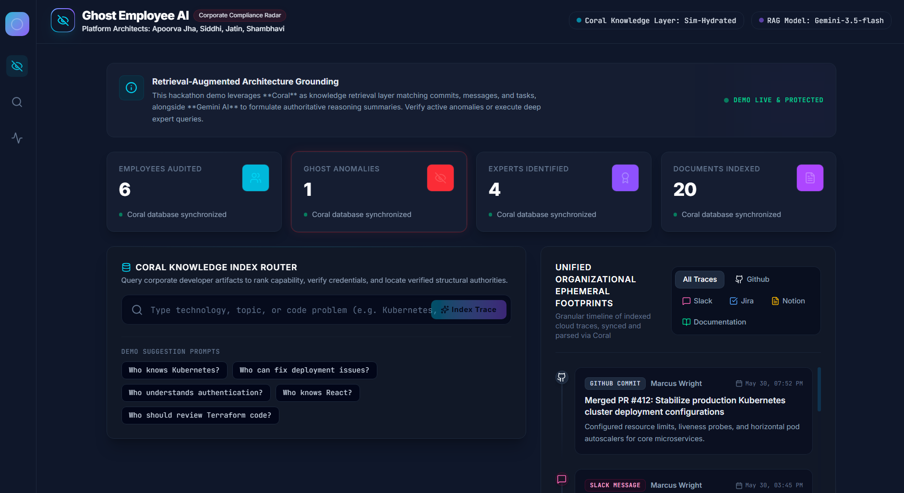

# Ghost Employee AI 👻

An AI-powered employee monitoring and productivity analysis system designed to track workflow efficiency, analyze employee performance, and generate intelligent insights for organizations.

## 🚀 Features

* 📊 **Productivity Dashboard**
  Monitor employee performance and workflow activity in real-time.

* 🧠 **AI-Based Insights**
  Generate smart recommendations and analyze productivity trends.

* 📁 **Evidence Timeline**
  Track employee activity logs and maintain structured evidence history.

* 🔍 **Search & Analytics**
  Search through employee records and analyze performance data.

* 📈 **Performance Metrics**
  View employee scoring, trends, and efficiency reports.

---

## 🛠 Tech Stack

* **Frontend:** React, TypeScript
* **Styling:** Tailwind CSS
* **AI Integration:** Gemini API / Coral Services
* **Build Tools:** Vite
* **Version Control:** Git & GitHub

---

## 💡 Project Overview

Ghost Employee AI is built to help organizations identify workflow patterns, monitor productivity, and make data-driven decisions through AI-assisted analysis.

The system focuses on:

* employee productivity tracking
* behavior analysis
* intelligent scoring
* workflow optimization

---

## 👨‍💻 My Contributions

* Built the initial foundation of the project
* Developed core application structure
* Worked on backend logic and feature integration
* Collaborated on improving AI workflows and analytics system

---

## 🤝 Team Collaboration

This project originated from my repository and later evolved into a collaborative team project with additional enhancements and final deployment.

---

## 📂 Project Structure

```text
src/
 ├── components/
 ├── services/
 ├── types/
 ├── utils/
 ├── App.tsx
 ├── index.css
```

---

## 🔮 Future Improvements

* Advanced employee behavior prediction
* Better AI scoring models
* Role-based authentication
* Cloud database integration
* Real-time notifications

---

## 📸 Screenshots

### Dashboard Preview

---

## ⭐ Support

If you find this project interesting, feel free to star the repository.
